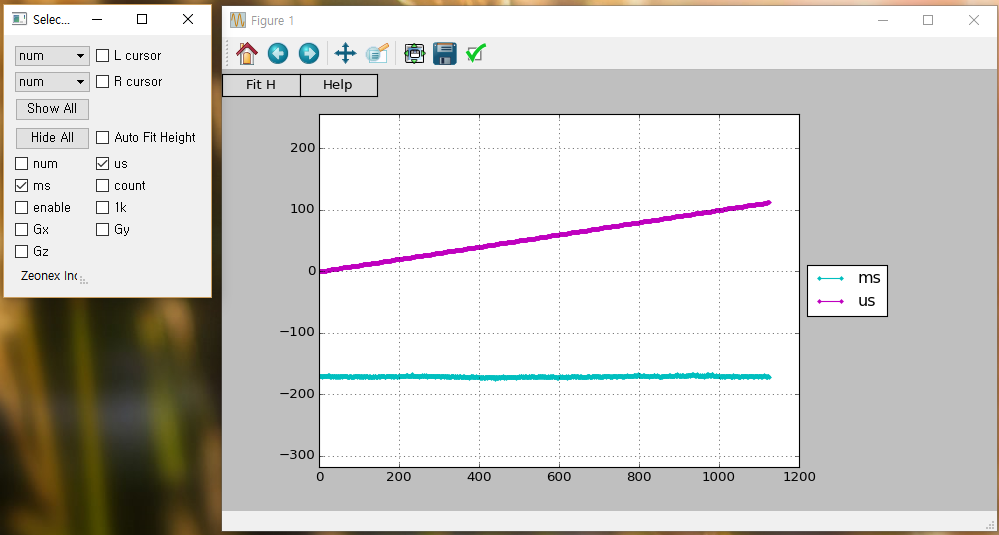
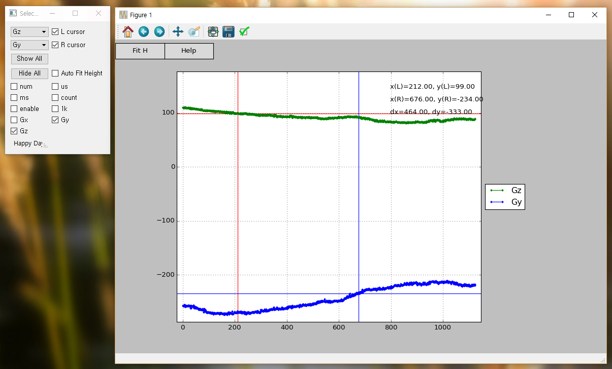
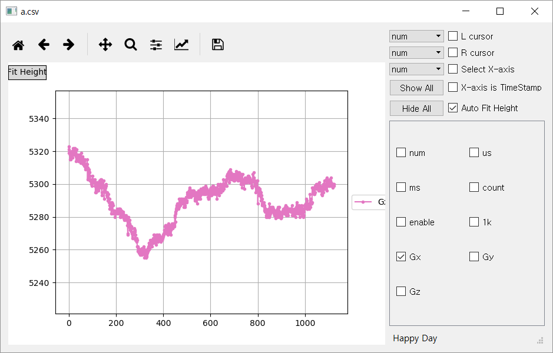

graphCSV
=====

graphCSV is python script plotting graph with CSV file.
It use matplotlib for plotting.

Highlights
-------

* Plot CSV file
* Graph display On/Off
* Auto-fit Y scale
* Two cursor support
* Cursor delta measurement

System Requirements
-------
Python 2.7

Usage
-------
Open CSV which header in first row
```
C:\python graphCSV.py a.csv
```
No header file
```
C:\python graphCSV.py -no_header a.csv
```
Merge GUI and Graph
```
C:\python graphCSV_one.py a.csv
```

Restrictions
-------
* CSV file should have no text except header


Manual
-------
1. Graph control (Zoom, Pan)

	Refer to [matplotlib documents](http://matplotlib.org/).


2. Graph menu
	* Fit H : fit height
	* Help : Not implemented yet


3. Outlook

    

3. Curosr control

	* Drag left(right) mouse button to move cursor.
	* Select list to choose line for cursor.
	
    
    
3. GUI dialog checkbox

	Drag left(right) mouse button.

3. Use graphCSV_one.py

	* Cursor is not working, :-C
	
    
    
	    
License
-------
Free to use

